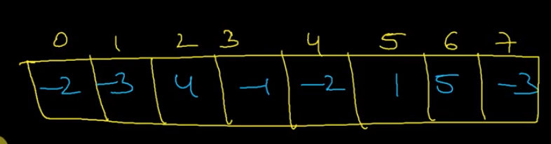
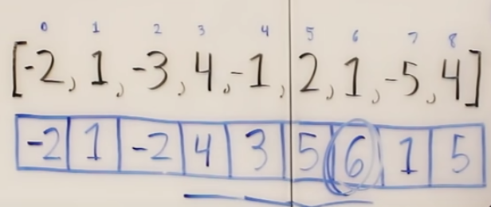
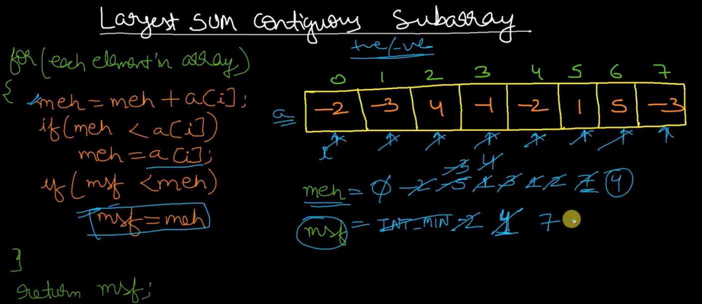
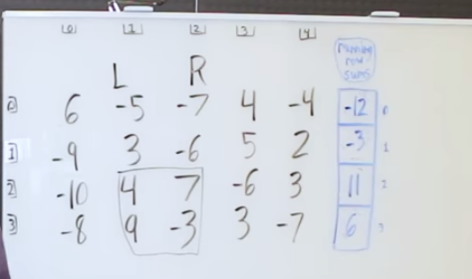
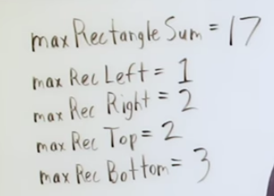

# Kadane's algorithm
- For given array
- Find largest sum of contiguous array

# Brute force approach 

# Using linear space 
- maxending(i) = max( maxsofar + arr[i], arr[i] )

```
var maxSubArray = function(nums) {
    const n = nums.length;
    const maxArr = new Array(n).fill(0);
    maxArr[0] = nums[0];
    let glolbal_max = nums[0];
    for (let i=1; i < n; i++) {
        maxArr[i] = Math.max(maxArr[i-1] + nums[i], nums[i]);
        glolbal_max = Math.max(glolbal_max, maxArr[i])
    }
    return glolbal_max;
};
```
# Using constant space 
- maxending(i) = max( maxsofar + arr[i], arr[i] )

```
var maxSubArray = function(nums) {
    let global_max = Number.MIN_SAFE_INTEGER;
    let max_so_far = Number.MIN_SAFE_INTEGER;
    for(const num of nums) {
        max_so_far = Math.max(max_so_far + num, num);
        global_max = Math.max(global_max, max_so_far);
    }
    return global_max;
};
```
# Kaden's on 2d


# Problems
## 1d
https://leetcode.com/problems/maximum-subarray/

## 2d
https://www.lintcode.com/problem/maximum-submatrix/description

https://leetcode.com/problems/max-sum-of-rectangle-no-larger-than-k/
# Reference
https://www.youtube.com/watch?v=2MmGzdiKR9Y

https://www.youtube.com/watch?v=YxuK6A3SvTs

https://www.youtube.com/watch?v=-FgseNO-6Gk